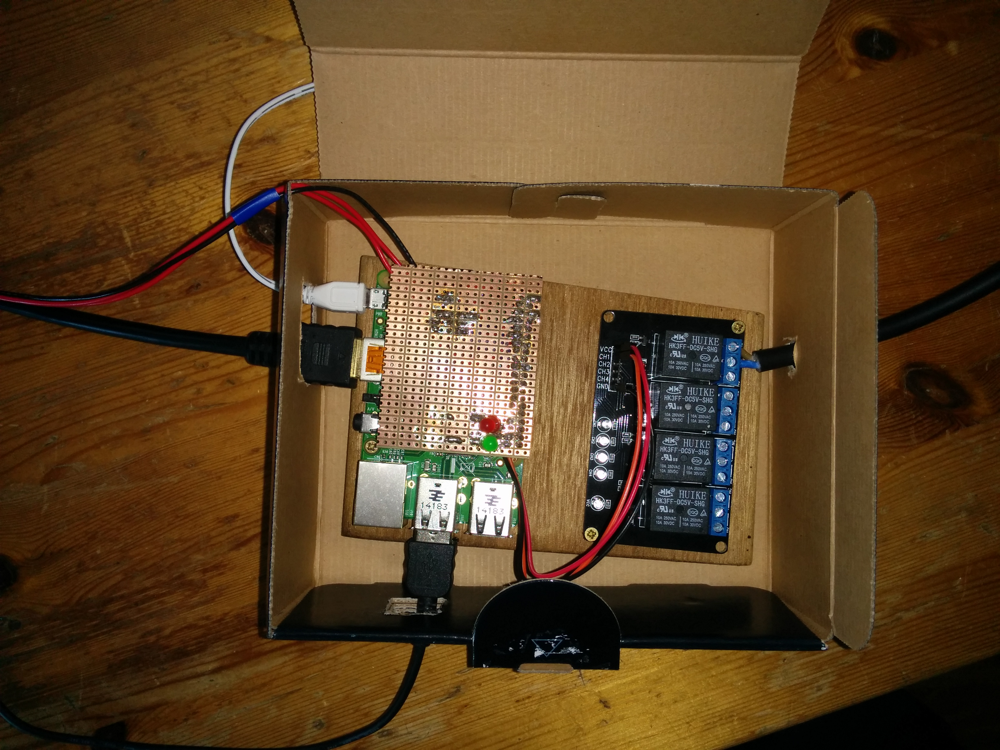

# Raspberry Pi LightBooth

Lightbooth in a box


Lightbooth with all connections visible


## Usage

### Connecting the peripherals

* Connect camera via USB to RPI. The camera should be set to M or P (preferably). Make sure the camera has no sleep mode or battery saver or so
* Connect button and relay to RPI, see [picture of breakout board](/doc/lightbooth_connections_breakout_board.jpg)
* Connect screen to RPI
* Put the socket in the wall, connect a light to the socket
* Connect 5v USB adapter to RPI. Make sure it has enough Ampere for the number of lights connected to the relay

Connections of relay (black, red, orange wires with blue tape) and button (black, red, red wires)


### Running lightbooth
```
cd lightbooth;
sudo python lightbooth.py
```

### What happens?

* When lightbooth is running, the green led on the breakout board will be on. 
* Once lightbooth is ready to take pictures it will display "ready for action" on the command line, and "Push the button" on the screen connected via HDMI. 
* When the button is clicked, the screen connected to HDMI will count down from `count_down_seconds` to 0, display 'smile :)', and take a picture.
* When a picture is being taken, the lights connected to the wall socket will switch off and the red led on the breakout board will turn on.
* Once the picture has been taken, the lights connected to the wall socket will switch back on, and the red led on the breakout board will turn off.
* The screen connected to HDMI will display 'transferring picture' until the picture is loaded on screen. 
* You can now click the button again to take a new picture.

### Good to know

* The high-res version of the picture is stored in /home/pi/lightbooth/images
* A center square, lower res, version of the picture is stored in /home/pi/lightbooth/images/instagram. This picture also has the `anomaly_img` embedded.
* A samba share called 'lightbooth' has been set up on the same dir. Connect to this share from another machine to run the slideshow from, e.g. via [pipresents](https://github.com/KenT2/pipresents-gapless). Connect with raspberry pi credentials to be able to modify the contents of this dir; default is view only.
* If you see "command given gphoto2 ..." on the command line, but don't hear the camera click, restart lightbooth.

## Config

### General config

* `show_hashtag` can be set to true to watermark all images at the bottom middle
* `hashtag` can be set to any alphanumeric string to watermark all images
* `do_count_down` can be set to true to show a count down on screen before before an image is taken
* `count_down_seconds` determines the number of seconds to count down on screen before an image is taken
* `upload_to_instagram` can be set to true to automatically upload images to instagram. Make sure to set `$username`, `$password`, and `$caption` to the desired values in instagram.php.
* `anomaly_img` is used to water mark the images (bottom right). Values can be anomaly_transparent_white.png or anomaly_transparent_black.png (or any other image in /home/pi/lightbooth)

Note: if the image falls off screen, edit /boot/config.php and set disable_overscan=0

### Gphoto

Gphoto2 is used to remote control the camera via USB. Before starting up lightbooth, you'll first need to make sure gphoto2 is configured properly.

For a Canon D6, a good configuration is as follows: aperture 22, iso 800, shutter speed 10, imageformat jpeg. This amounts to the following gphotos settings, to be set via the command line before you start lightbooth:

```
sudo gphoto2 --set-config /main/capturesettings/shutterspeed=15
sudo gphoto2 --set-config /main/imgsettings/iso=4
sudo gphoto2 --set-config /main/capturesettings/aperture=15
sudo gphoto2 --set-config /main/imgsettings/imageformat=1
```

To experiment with other values, use the following on the command line:
```
sudo gphoto2 --list-config # for an overview of all configurable parameters
sudo gphoto2 --get-config /main/capturesettings/shutterspeed # for an overview of all shutter speed values
sudo gphoto2 --get-config /main/imgsettings/iso # for an overview of all iso values
sudo gphoto2 --get-config /main/capturesettings/aperture # for an overview of all aperture values
```

### Wifi

Keep in mind, wired is always more reliable on pi. Nevertheless:

* sudo nano /etc/wpa_supplicant/wpa_supplicant.conf
* Go to the bottom of the file and add the following:
```
network={
    ssid="The_network_name"
    psk="Your_wifi_password"
}
```
* see [here](https://www.raspberrypi.org/documentation/configuration/wireless/wireless-cli.md) for more elaborate instructions 

## Clean install

[Download](http://www.raspberrypi.org/downloads) and install Raspian.

Update Raspian
```
sudo apt-get update
sudo apt-get upgrade
```

Install newest version of gphoto from source (takes a while)
```wget https://raw.githubusercontent.com/gonzalo/gphoto2-updater/master/gphoto2-updater.sh && chmod +x gphoto2-updater.sh && sudo ./gphoto2-updater.sh```

Install Adafruit GPIO Library
```git clone http://github.com/adafruit/Adafruit-Raspberry-Pi-Python-Code.git```

Install the Python GPIO libraries for accessing the pins in python + install pygame which will be used as display + install php5 things for uploading to instagram
```sudo apt-get install python-dev python-rpi.gpio python-pygame python-setuptools php5-cli php5-curl```

If screen has black borders, do the following
```sudo nano /boot/config.txt```
Set ```disable_overscan=1```

Git clone this repo: ``` git clone git@github.com:ErikBorra/lightbooth.git ```